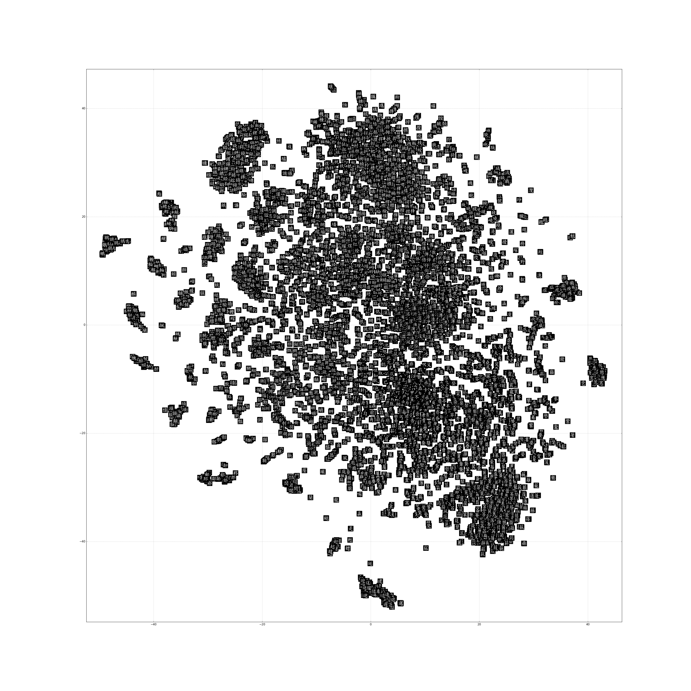

## convolutional autoencoder (convAE)

Our convAE is defined in `./models/conv_ae_char_nopool.py`
The model was constructed with `python2` and `tensorflow v0.12`.
We uploaded our model paprameters in `checkpoints/`.

We constructed a python dict object to store all Chinese bitmaps. (In `../data/char_dict.pkl` )
The keys are UTF-8 Chinese characters, and values are 2-dim numpy arrays.
This dict was serialized using pickle.

To use this code, your should first install the following packages.


Commands:
*   Train the convAE. This wiil output some random reconstruction image of characters.
    ```python
    pip install Pillow # make sure PIL was installed.
    python train_conv_ae_char_nopool.py
    ```
    
*   Generate glyph features of each character. This will output a *.pkl file in `../data/char_feat_dict.pkl`.
    ```
    python make_char_feat_dict_nopool.py
    ```
    
*   Obtain t-SNE results
    ```python
    pip install tsne matplotlib # make sure these were installed. 
    python tsne_feature_nopool.py
    ```
    This will output a png file as shown below. (The dimensions are large)
    
